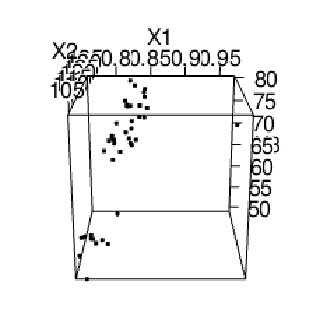

```{r}
library(MASS)
library(rgl)
library(lattice)
```
## Q1. 
Suppose mean vector and the variance-covariance matrix given below.

```{r}
mu <- c(-1, 2, -5)
sigma <- matrix(c(9, 4, 1,
                  4, 16, -1,
                  1, -1, 14), nrow = 3, byrow = TRUE)
```

### (a)
Calculate population correlation matrix.

Note that population correlation matrix equals $\rho = D^{-1/2} \sum D^{1/2}$.
Also, since $D^{-1/2} = diag(\frac{1}{\sqrt\sigma_{ii}})$ and $\sigma_{11} = 9, \sigma_{22} = 16, \sigma_{33} = 4$, We can calculate $D^{-1/2}$.

$$D^{-1/2} = \begin{pmatrix}
1/3 & 0 & 0 \\
0 & 1/4 & 0 \\
0 & 0 & 1/2
\end{pmatrix}$$

Therefore, the population correlation matrix equals
$$\rho =  D^{-1/2} \sum D^{1/2} = \begin{pmatrix}
1/3 & 0 & 0 \\
0 & 1/4 & 0 \\
0 & 0 & 1/2
\end{pmatrix}
\begin{pmatrix}
9 & 4 & 1 \\
4 & 16 & -1 \\
1 & -1 & 14
\end{pmatrix}
\begin{pmatrix}
1/3 & 0 & 0 \\
0 & 1/4 & 0 \\
0 & 0 & 1/2
\end{pmatrix}
=\begin{pmatrix}
1 & 1/3 & 1/6 \\
1/3 & 1 & -1/8 \\
1/6 & -1/8 & 1
\end{pmatrix}
$$

```{r}
d <- matrix(c(1/3, 0, 0,
              0, 1/4, 0,
              0, 0, 1/2), nrow = 3, byrow = TRUE)
sigma <- matrix(c(9, 4, 1,
                  4, 16, -1,
                  1, -1, 4), nrow = 3, byrow = TRUE)

ans <- d %*% sigma %*% d
print(ans)
```

### (b)

Let $a'= [1, -1, 1]$ and $x = [x_1, x_2, x_3]$ where $Z_1 = a'X$.
$$E(Z_1) = E(a'X) = a'E(X) = a'\mu = 
\begin{pmatrix}
1 & -1 & 1 \\
\end{pmatrix} \cdot
\begin{pmatrix}
-1 \\
2 \\
-5
\end{pmatrix}
= -8
$$

$$Var(Z_1) = a'\sum a = 
\begin{pmatrix}
1 & -1 & 1 \\
\end{pmatrix} \cdot
\begin{pmatrix}
9 & 4 & 1 \\
4 & 16 & -1 \\
1 & -1 & 4
\end{pmatrix} \cdot
\begin{pmatrix}
1 \\
-1 \\
1
\end{pmatrix}
= 25
$$
```{r}
a <- matrix(c(1, -1, 1), nrow = 3)
mu <- c(-1, 2, -5)
sigma <- matrix(c(9, 4, 1,
                  4, 16, -1,
                  1, -1, 4), nrow = 3, byrow = TRUE)
e1 = t(a) %*% mu
var1 = t(a) %*% sigma %*% a

print("Mean of Z1:")
print(e1)

print("Variance of Z1:")
print(var1)

```


### (c)
Let $b'= [-1, 2, 3]$ and $x = [x_1, x_2, x_3]$ where $Z_2 = b'X$.
$$E(Z_2) = E(b'X) = b'E(X) = b'\mu = 
\begin{pmatrix}
-1 & 2 & 3 \\
\end{pmatrix} \cdot
\begin{pmatrix}
-1 \\
2 \\
-5
\end{pmatrix}
= -10
$$

$$Var(Z_2) = b'\sum b = 
\begin{pmatrix}
-1 & 2 & 3 \\
\end{pmatrix} \cdot
\begin{pmatrix}
9 & 4 & 1 \\
4 & 16 & -1 \\
1 & -1 & 4
\end{pmatrix} \cdot
\begin{pmatrix}
-1 \\
2 \\
3
\end{pmatrix}
= 75
$$
```{r}
b <- matrix(c(-1, 2, 3), nrow = 3)
mu <- c(-1, 2, -5)
sigma <- matrix(c(9, 4, 1,
                  4, 16, -1,
                  1, -1, 4), nrow = 3, byrow = TRUE)
e2 = t(b) %*% mu
var2 = t(b) %*% sigma %*% b

print("Mean of Z2:")
print(e2)

print("Variance of Z2:")
print(var2)

```

### (d)

$$ E(Z_3) = E\begin{pmatrix}
Z_1 \\
-Z_2
\end{pmatrix}
= 
\begin{pmatrix}
-8 \\
-10
\end{pmatrix}
$$
$Var(Z_1) = 25$ and $Var(-Z_2) = Var(Z_2) = 75$

$$
Cov(Z_1, -Z_2) = Cov(a'x, -b'x) = -a'\sum b
= 
- 1 \cdot
\begin{pmatrix}
1 & -1 & 1 \\
\end{pmatrix} \cdot
\begin{pmatrix}
9 & 4 & 1 \\
4 & 16 & -1 \\
1 & -1 & 4
\end{pmatrix} \cdot
\begin{pmatrix}
-1 \\
2 \\
3
\end{pmatrix}
= 14
$$
```{r}
cov_z1z2 = -t(a) %*% sigma %*% b
print("Covariance for Z1, Z2")
print(cov_z1z2)
```

Therefore $$ Cov(Z_3) = 
\begin{pmatrix}
25 & -14\\
-14& 75 \\
\end{pmatrix}
$$

### (e)

```{r}
n <- 50
sample_data <- mvrnorm(n, mu, sigma)
print("Sample mean")
print(colMeans(sample_data))
print("Sample Variance")
print(cov(sample_data))
```

### (f)
``` {r}
p <- ncol(sample_data)
par(mfrow=c(2,2))
for(i in 1:p){qqnorm(sample_data[,i],xlab="Quantiles of Standard Normal",ylab=paste("Var",i))
    qqline(sample_data[,i])}

```

The plot shows that the distribution follows the multivariate normal
distribution, which means that the plot follows the straight line.

## (2)
### (a)
``` {r}
par(mfrow=c(2,2))
data <- read.table('Paper.dat', header = T)
attach(data)
hist(X1)
hist(X2)
hist(X3)

```

One can observe that X1 (Density) has an outlier by boxplot.
Also by histogram, We can find that X2 follows the normal distribution similarly and X3 does not.


### (b)
```{r}
pairs(data)
```

X1 and X2 are strongly related (except 1 outlier).
X1 and X3 are strongly related (except 1 outlier).
X2 and X3 are strongly related.

### (c)
```{r}
# plot3d(data)
```
{width=150px height=150px}


We can identify one outlier by drawing the graph.

### (d)

```{r}
print("Sample mean")
xm <- colMeans(data)
print(xm)
print("Sample Variance")
Sx <- cov(data)
print(Sx)
```

### (e)
```{r}
p <- ncol(data)
par(mfrow=c(2,2))
for(i in 1:p){qqnorm(data[,i],xlab="Quantiles of Standard Normal",
                     ylab=paste("Var", colnames(data)[i]),
                     main=paste("QQ plot fot Var", colnames(data)[i]))
    qqline(data[,i])}

```

The plot for X1 shows that the distribution follows the multivariate normal
distribution (except 1 outlier), which means that the plot follows the straight line. This has same result with the box plot drew in (a).

The plot for X2 shows that the distribution follows the multivariate normal
distribution, which means that the plot follows the straight line. This has same result with the histogram drew in (a) which follow the normal distribution similarly.

The plot for X3 shows that the distribution does not follow the multivariate normal distribution, which means that the plot does not follow the straight line. This has same result with the histogram drew in (a) which did not follow the normal distribution.


### (f)
```{r}
di2 = mahalanobis(data, xm, Sx)
di2
```

### (g)
```{r}
cnt <- length(xm)
qqmath(di2,distribution = function(p) qchisq(p,df=cnt))
```

This data set follows the  multivariate normal distribution since the plot follows the chi-Squared distribution (except 1 outlier).